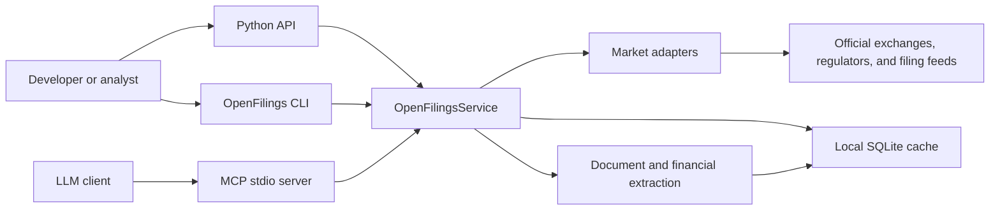
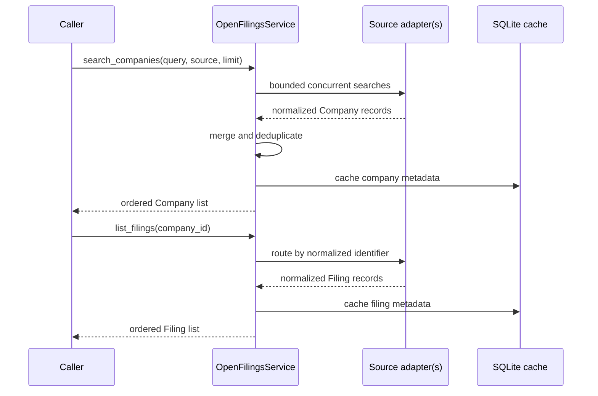
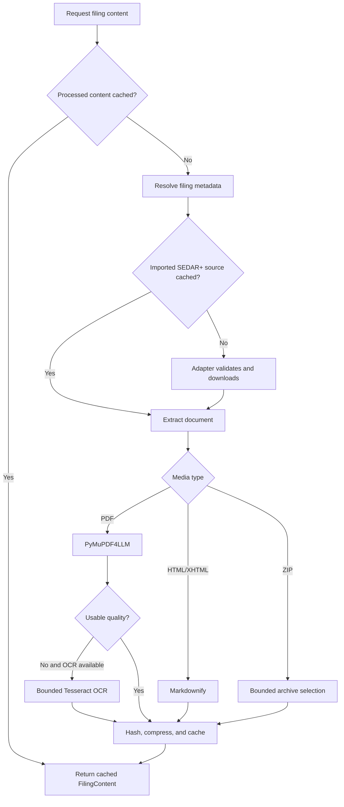

# OpenFilings Architecture

## 1. Purpose

OpenFilings is a local-first Python toolkit for discovering listed companies,
retrieving public filings, converting filing documents to Markdown, and
normalizing financial statements across non-US markets.

The architecture borrows the collection-first ergonomics of EdgarTools while
keeping regulator-specific behavior behind adapters. SEC concepts such as CIKs,
accession numbers, SGML, and US-GAAP are deliberately absent from the core.

## 2. Architectural goals

- Present one stable Python, CLI, and MCP interface across different markets.
- Keep the base installation small enough for local and agent workflows.
- Prefer official, public, keyless data sources where they exist.
- Preserve source provenance while returning normalized domain models.
- Bound network, archive, memory, OCR, cache, and MCP response usage.
- Degrade explicitly when a regulator does not expose a stable automated API.
- Make a new market an adapter addition rather than a core rewrite.

## 3. System context



OpenFilings is currently a modular monolith. It runs in the caller's process
and uses outbound HTTPS plus a local SQLite database. It does not require a web
server, message broker, external database, or background worker.

## 4. Component layout

| Layer | Responsibility | Main modules |
|---|---|---|
| Interfaces | Human, application, and LLM entry points | `cli.py`, `server.py`, `__init__.py` |
| Resources | EdgarTools-style bound company and filing objects | `resources.py`, `domain.py` |
| Application service | Source routing, orchestration, caching, extraction, and errors | `service.py` |
| Source adapters | Regulator-specific discovery, listing, download, and validation | `adapters/` |
| Normalized models | Immutable contracts shared across every layer | `models.py` |
| Document extraction | PDF, HTML, tagged ZIP, OCR, and quality assessment | `extraction/` |
| Financial extraction | Inline XBRL and market-specific statement normalization | `xbrl/`, `bmv_json.py` |
| Persistence | Compressed metadata, documents, and financials | `storage/sqlite.py` |
| Operations | Configuration, bounds, smoke tests, CI, and security checks | `config.py`, `limits.py`, `smoke.py`, `.github/workflows/` |

## 5. Public interfaces

### Python API

`OpenFilings` aliases `OpenFilingsService`. The high-level API returns bound,
immutable resources:

- `CompanyResources` supports slicing, `head`, `filter`, and `find`.
- `FilingResources` supports slicing, `head`, `latest`, `filter`, and `prefetch`.
- `FilingResource` exposes Markdown, document sections, ranked search, and
  normalized financials.

Lower-level normalized `Company`, `Filing`, and `FilingContent` models remain
available for integrations.

### CLI

The Typer CLI exposes:

- `search`
- `filings`
- `fetch`
- `financials`
- `import-sedar`
- `sections`
- `inspect-document`
- `cache status`
- `cache prune`
- `serve`

Every command creates the same application service used by the Python and MCP
interfaces.

### MCP

The FastMCP server runs over stdio and exposes nine tools:

- `companies_search`
- `filings_list`
- `sedar_filing_import`
- `filing_outline`
- `filing_sections`
- `filing_read`
- `filing_search`
- `filing_markdown`
- `filing_financials`

The MCP contract uses progressive disclosure. Metadata comes first, outlines
and ranked excerpts guide navigation, and large Markdown or statement results
are bounded and paginated. Responses use compact success or failure envelopes
with actionable next steps.

## 6. Source-adapter boundary

Most market connectors implement the `PublicMarketClient` protocol:

```python
class PublicMarketClient(Protocol):
    source: SourceName

    async def search_companies(self, query: str, *, limit: int = 10) -> list[Company]: ...
    async def list_filings(
        self,
        company_id: str,
        *,
        category: str | None = "accounts",
        limit: int = 25,
    ) -> list[Filing]: ...
    async def download_document(self, document_id: str) -> SourceDocument: ...
    def matches_company_id(self, value: str) -> bool: ...
    def matches_filing_id(self, value: str) -> bool: ...
    async def aclose(self) -> None: ...
```

FCA, EDINET, ESEF, CVM, and SGX predate the generic tuple of market adapters
and are wired explicitly in the service. They still return the same
normalized models and follow the same service pipeline.

| Adapter | Coverage | Discovery and retrieval |
|---|---|---|
| `FcaNsmClient` | United Kingdom | FCA National Storage Mechanism |
| `EdinetClient` | Japan | EDINET issuer list; API key required for filing API |
| `EsefClient` | NL, FR, ES, IT, DK, SE, FI | filings.xbrl.org ESEF index |
| `CvmClient` | Brazil | CVM company register and IPE archive |
| `SgxClient` | Singapore | SGX company and financial-report feeds |
| `BmvClient` | Mexico | BMV issuer and financial-information services |
| `NseClient` | India | NSE equity register and annual reports |
| `SedarClient` | Canada | TSX/TSXV discovery and explicit SEDAR+ import |
| `SmvClient` | Peru | SMV issuer and financial-statement data |
| `SfcClient` | Colombia | SFC/SIMEV issuer and filing services |

Adapters own source-specific URL construction, response parsing, identifier
matching, exchange-product filtering, host allowlists, and download bounds.
They do not expose regulator payloads to the rest of the application.

## 7. Core data flows

### Company and filing discovery



An `all` search runs configured sources concurrently. Individual source errors
are isolated so one unavailable market does not necessarily make a global
search unusable. Explicit single-source calls return configuration or source
errors instead of silently hiding them.

### Document retrieval



Processed Markdown is content-hashed. Duplicate content can reuse an existing
extraction. Original documents are normally discarded after conversion;
explicit SEDAR+ imports retain the compressed source PDF because later access
must not depend on a browser session.

### Financial-statement extraction

The service first selects the best structured route for the source document:

1. Inline XBRL is streamed into normalized concepts, periods, units, decimals,
   and dimensions.
2. CVM filings first try Brazil's Open Data DFP/ITR datasets - a
   standardized chart of accounts published as bulk CSV/ZIP archives - before
   falling back to the filing PDF.
3. BMV quarterly IFRS JSON is parsed directly.
4. SMV statement tables are mapped from official bounded table operations.
5. Supported PDFs use aligned table/text extraction.
6. Image-only PDFs may use bounded OCR before statement parsing.

The result is a `FilingFinancials` object containing up to five standardized
statement types: income statement, balance sheet, cash-flow statement,
comprehensive income, and changes in equity.

## 8. Domain model

The normalized boundary is intentionally small:

- `Company` contains the stable OpenFilings ID, source identity, market,
  country, ticker, LEI when available, and provenance URL.
- `Filing` contains normalized dates, category, document availability,
  language, source identity, and provenance.
- `FilingContent` contains Markdown, extraction method, quality evidence, hash,
  and cache state.
- `FilingFinancials` contains standardized statements, source concepts,
  reporting periods, values, units, decimals, and dimensions.

Pydantic models are frozen and ignore unknown input fields. This prevents
accidental mutation while allowing cached payloads to survive additive model
changes.

## 9. Persistence

The local database defaults to `.openfilings/openfilings.sqlite3` and contains:

| Table | Contents |
|---|---|
| `companies` | Normalized company JSON |
| `filings` | Normalized filing JSON indexed by company ID |
| `market_state` | Adapter cursors and reusable market metadata |
| `filing_content` | zlib-compressed Markdown, extraction metadata, quality, and hash |
| `source_documents` | zlib-compressed explicit SEDAR+ source PDFs |
| `filing_financials` | zlib-compressed normalized financial JSON |

The cache has a configurable logical budget, defaults to 512 MB, and supports
inspection, pruning, and vacuuming. Metadata remains small; large processed
artifacts are pruned by access time when required.

## 10. Resource and security boundaries

- Shared HTTP behavior has timeouts and bounded retries.
- Downloads and expanded archives have explicit byte and member limits.
- Document redirects and final hosts are validated by each adapter.
- SEDAR+ imports accept only official HTTPS paths and verified PDF content.
- OCR has configurable mode, DPI, language, executable, and page limits.
- Inline XBRL uses a streaming parser instead of a full-document DOM.
- MCP output limits prevent a single tool call from returning an entire filing
  unintentionally.
- `EDINET_API_KEY` is read from the environment, passed only to EDINET, and is
  never stored in SQLite.

See `SECURITY.md` for reporting and supported-version policy.

## 11. Configuration

| Environment variable | Default | Purpose |
|---|---:|---|
| `OPENFILINGS_DATA_DIR` | `.openfilings` | Cache directory |
| `EDINET_API_KEY` | empty | Japan filing API access |
| `OPENFILINGS_OCR_MODE` | `auto` | `auto`, `never`, or `always` |
| `OPENFILINGS_OCR_LANGUAGE` | `eng` | Installed Tesseract language set |
| `OPENFILINGS_OCR_DPI` | `200` | OCR render resolution |
| `OPENFILINGS_OCR_MAX_PAGES` | `250` | OCR page ceiling |
| `OPENFILINGS_TESSERACT_EXECUTABLE` | `tesseract` | OCR executable |
| `OPENFILINGS_CACHE_MAX_MB` | `512` | Logical cache budget |

Request timeout and retry defaults currently live in the immutable `Settings`
model and are injected into every source adapter.

## 12. Verification and delivery

The offline suite covers adapters, service routing, CLI, MCP, extraction,
financials, storage, SEDAR+ imports, and production hardening. CI runs:

- Ruff lint and formatting checks
- pytest on Python 3.11 through 3.14
- wheel and source-distribution builds
- installed-package smoke tests
- CodeQL analysis
- locked dependency auditing
- scheduled live smoke tests for keyless regulator contracts

Live checks are kept separate from deterministic unit tests because upstream
regulator services can change or be temporarily unavailable.

## 13. Key decisions and trade-offs

| Decision | Benefit | Accepted trade-off | Revisit trigger |
|---|---|---|---|
| Modular monolith | Small footprint and simple local installation | No independent scaling of extraction or adapters | Sustained hosted multi-user demand |
| Regulator-neutral models | One API across markets | Some source-specific fields are intentionally omitted | A broadly required field cannot be represented |
| Adapter isolation | Upstream changes stay localized | Thirteen integrations must be maintained | Repeated shared behavior justifies a stronger framework |
| SQLite cache | Zero-configuration offline reuse | Single-host and limited concurrent writers | Hosted service or shared cache requirement |
| Streaming XBRL | Fast, bounded extraction | Not a validating XBRL processor | Standards-complete validation becomes a core requirement |
| Optional OCR | No heavy OCR dependency by default | Image-only reports need Tesseract installed | A lighter reliable embedded OCR option appears |
| Explicit SEDAR+ import | Respects browser and anti-automation boundaries | Canada lacks automated filing discovery | SEDAR+ publishes a stable public API |
| Stdio MCP | Minimal local LLM integration | No remote HTTP transport or authentication | A hosted MCP deployment is required |

The foundational EdgarTools-inspired decision is recorded in
`docs/architecture/ADR-001-edgartools-inspired-global-core.md`.

## 14. Adding a market

1. Identify an official public issuer source and filing source.
2. Implement `PublicMarketClient`, preferably on the shared retrying HTTP base.
3. Define stable company and filing ID prefixes.
4. Filter the issuer universe to operating exchange-listed companies.
5. Normalize every response into `Company`, `Filing`, and `SourceDocument`.
6. Add strict host, path, media-type, size, archive, and redirect validation.
7. Register the source name in the normalized models and service factory.
8. Add fixture-driven adapter, routing, cache, CLI, and MCP tests.
9. Add a bounded live smoke case when the source is keyless and automatable.
10. Document access constraints, licensing, and known limitations.

Market-specific extraction should be added only when generic HTML, PDF, or
Inline XBRL processing cannot preserve the required structure.

## 15. Current limitations

- Japan filing retrieval needs an EDINET API key.
- Canada requires a user-generated SEDAR+ URL or browser-downloaded PDF.
- ESEF completeness depends on the upstream filings.xbrl.org index.
- PDF table extraction is heuristic and may return an explicit unavailable
  result for layouts that cannot be normalized confidently.
- Tesseract is an optional system dependency and language packs are not bundled.
- The MCP server is local stdio only.
- OpenFilings is a research and retrieval tool, not a validating XBRL processor
  or authoritative legal record.
