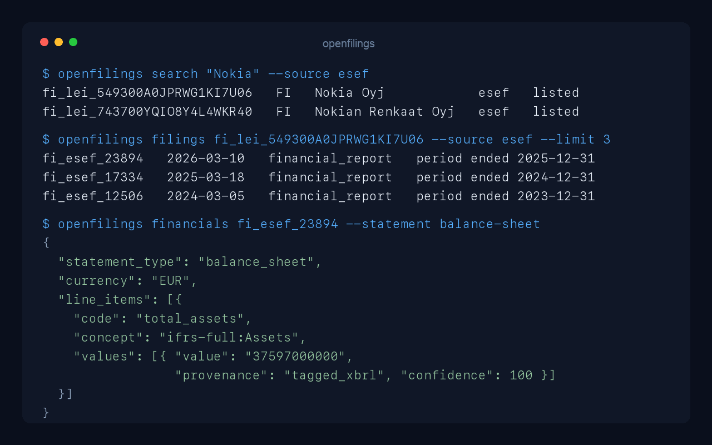
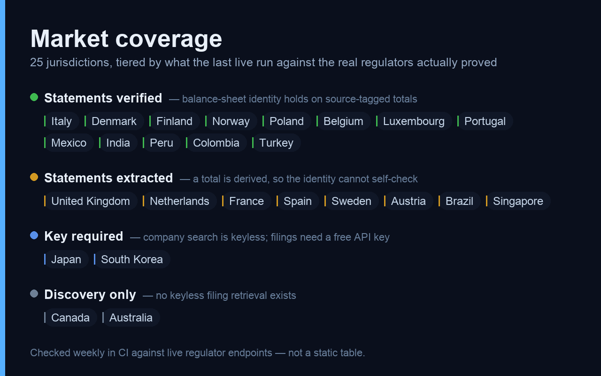

# OpenFilings

**Public-company filings for 25 non-US markets — normalized, keyless, local-first.**

[](https://github.com/ryanrodrigues25200525-svg/openfilings/actions/workflows/ci.yml)
[](LICENSE)
[](pyproject.toml)



EdgarTools gives you SEC/EDGAR in a few lines of Python. OpenFilings applies the
same collection-first ergonomics to everything outside the US: resolve a listed
company, list its filings, and get normalized IFRS financial statements — read
from the regulator's own tagged or structured data wherever it exists, rather
than scraped out of a PDF.

It runs as a Python library, a CLI, and a local MCP server, so an LLM agent can
work through filing outlines, sections, and selected statements instead of
pulling whole annual reports into context.

```python
import asyncio

from openfilings import OpenFilings


async def main() -> None:
    async with OpenFilings.from_settings() as openfilings:
        company = await openfilings.company("Nokia", source="esef")
        filings = await company.get_filings(source="esef", limit=5)
        financials = await filings.latest().financials()
        print(financials.balance_sheet().to_markdown())


asyncio.run(main())
```

```
## Balance sheet (EUR)

| Line item                 | instant 2025-12-31 | instant 2024-12-31 |
| ------------------------- | -----------------: | -----------------: |
| Cash and cash equivalents |         5462000000 |         6623000000 |
| Inventories               |         2209000000 |         2163000000 |
| Total assets              |        37597000000 |        39149000000 |
```

## What works today



The tiers above are not a marketing summary — they are the outcome of the last
run of `openfilings.smoke` against the live regulator endpoints, and CI re-runs
it weekly.

| Status | Markets | What you get |
| --- | --- | --- |
| ✅ **Statements verified** | Italy, Denmark, Finland, Norway, Poland, Belgium, Luxembourg, Portugal, Mexico, India, Peru, Colombia, Turkey | Search, filings, and normalized statements whose balance sheet reconciles on the issuer's own tagged totals |
| 🟡 **Statements extracted** | United Kingdom, Netherlands, France, Spain, Sweden, Austria, Brazil, Singapore | The same pipeline, but the filing leaves one total to be derived, so `assets = liabilities + equity` cannot independently self-check. Singapore is PDF-heuristic; the rest are tagged |
| 🔑 **Key required** | Japan (EDINET), South Korea (DART) | Company search is keyless for Japan. Filings need a free `EDINET_API_KEY`; DART needs `DART_API_KEY` for everything. **South Korea has never been run against a live key** |
| 🔍 **Discovery only** | Canada (SEDAR+), Australia (ASX) | Company search only. Canada additionally supports explicit user-supplied document imports. Neither regulator exposes keyless filing retrieval — see below |

Colombia is a hybrid worth calling out: the balance sheet comes from SFC's CUIF
supervisory dataset and reconciles exactly, while the income statement still
comes from the PDF, because CUIF reports income and expense accounts unclosed.

Every normalized value carries its extraction `provenance` and a 0–100
`confidence`, so a tagged XBRL fact is never silently mixed with a derived or
PDF-parsed one. See [Research controls](#research-controls) for what the live
suite does and does not prove.

## Known issues

Tracked openly rather than discovered by you. Every item is a real,
reproduced finding — most came from probing 42 issuers the test suite never
touches. [FIXES.md](FIXES.md) is the full working checklist, with the proposed
fix beside each item and the research-model gaps that have no issue yet; the
[issue tracker](https://github.com/ryanrodrigues25200525-svg/openfilings/issues)
carries the reproductions.

**Correctness**

- [ ] [#6](https://github.com/ryanrodrigues25200525-svg/openfilings/issues/6) — Unilever's Form 20-F extracts a wrong currency (PEN for a UK issuer) and a ~1000× scale. Loudly flagged: `validation.ok` is `false` with four failed rules, so it is never returned as trustworthy
- [ ] [#12](https://github.com/ryanrodrigues25200525-svg/openfilings/issues/12) — one LEI can produce two company IDs when an issuer files ESEF in two jurisdictions
- [ ] [#14](https://github.com/ryanrodrigues25200525-svg/openfilings/issues/14) — some ESEF issuers return a years-old "latest" filing; upstream gap vs discovery bug not yet separated

**Verification gaps**

- [ ] [#7](https://github.com/ryanrodrigues25200525-svg/openfilings/issues/7) — the Sweden and Singapore regression guards cannot fire, because both filings derive a total and the identity check correctly refuses a circular comparison
- [ ] [#8](https://github.com/ryanrodrigues25200525-svg/openfilings/issues/8) — pinned accuracy benchmarks cover 2 issuers across 25 markets. A value can reconcile perfectly and still be wrong
- [ ] [#9](https://github.com/ryanrodrigues25200525-svg/openfilings/issues/9) — the multi-issuer probe that found this session's defects was a throwaway script, so the next per-issuer defect will be equally invisible
- [ ] [#11](https://github.com/ryanrodrigues25200525-svg/openfilings/issues/11) — South Korea has never run against a live DART key; mocked tests only

**Usability and operations**

- [ ] [#10](https://github.com/ryanrodrigues25200525-svg/openfilings/issues/10) — brand and ticker names don't resolve (`PKO`, `Ford Otosan`), since matching is a substring test against the registered legal name
- [ ] [#15](https://github.com/ryanrodrigues25200525-svg/openfilings/issues/15) — cached facts and a running MCP server both survive a fix, so a corrected figure may not reach you until you restart and re-extract
- [ ] [#13](https://github.com/ryanrodrigues25200525-svg/openfilings/issues/13) — every Dependabot PR fails CI because `uv.lock` is not regenerated

## What is not coming

Two markets are permanently capped rather than merely unbuilt, and both were
confirmed against live endpoints rather than assumed:

- **Canada** — SEDAR+ blocks non-browser filing queries. Document import from a
  user-supplied public URL works and is the supported path.
- **Australia** — ASX's announcements feed accepts no issuer filter, one
  uncached page costs 18–20 seconds and spans about six days, and the
  per-company endpoint is capped at five mostly-routine items. A single annual
  report is roughly twelve minutes of paging away, so filing retrieval was
  removed rather than shipped slow.

Also ruled out: **Switzerland** (SIX's data APIs are commercial), **Egypt**
(disclosure pages sit behind a CAPTCHA, which this project will not bypass),
**Hong Kong** (out of scope by decision), and **Argentina**, **Malaysia**,
**Qatar** (no keyless structured path found at reasonable effort).

## What is being looked at next

No dates are promised. In rough order of how close each one is:

| Candidate | State |
| --- | --- |
| `category="current_report"` / `"proxy"` for UK, India, Brazil | Cheapest remaining EdgarTools-parity step — needs only a type-code allowlist per source, no new HTTP calls. These disclosures are already returned unfiltered today |
| Live verification of South Korea (DART) | Needs a free API key. The connector is written and unit-tested; nothing about it has touched a real response |
| Pinned reference facts for Sweden and Singapore | Their regression guards currently cannot fire, because both filings derive a total. Closing this needs source-transcribed figures in `benchmarks.py` |
| **Germany** | Blocked upstream — `filings.xbrl.org` currently lists German filings as unavailable for reliable discovery |
| **Chile**, **Indonesia**, **Thailand** | On hold. Chile's CMF exposes a legacy PHP form rather than an API and needs fresh live reconnaissance before any build starts |
| Insider and major-holding coverage for the 13 ESEF national OAMs | Largest remaining lift, lowest priority |

Institutional holdings in the 13F sense are **deliberately out of scope**: no
general non-US equivalent exists, and the two narrow leads found were not worth
the surface area. See [FUTURE_INTEGRATIONS.md](FUTURE_INTEGRATIONS.md) for the
full research trail behind every row above.

## Test runs

Three layers, and they prove different things. Real output, not illustrative.

### Unit tests — `uv run pytest`

```
219 passed, 7 warnings in 1.65s
```

Fast and offline: every source is a recorded fixture, so this catches parsing
and mapping regressions but says nothing about whether a regulator's endpoint
still exists or still returns the same shape.

### Live smoke — `uv run python -m openfilings.smoke`

One issuer per keyless source, against the real endpoints, ending in a tally
of what was actually proved:

```
PASS  ESEF Italy       it_lei_WOCMU6HCI0OJWNPRZS33  it_esef_18316   held
PASS  ESEF Finland     fi_lei_549300A0JPRWG1KI7U06  fi_esef_23894   held
PASS  ESEF Portugal    pt_lei_529900CLC3WDMGI9VH80  pt_esef_19216   held
PASS  Mexico BMV       mx_bmv_6024                  mx_bmv_filing_1575696  held
PASS  India NSE        in_nse_RELIANCE              in_nse_filing_29285    held
PASS  Colombia SFC     co_sfc_001_039               co_sfc_filing_125473   held
PASS  Turkey KAP       tr_kap_4028e4a1486ec80a...   tr_kap_1605247  held
PASS  ESEF Sweden      se_lei_549300HGV012CNC8JD22  se_esef_18913
      not_applicable (no common source-extracted balance-sheet period)
PASS  Singapore SGX    sg_sgx_1U68                  sg_sgx_CMLEN559K1LSH1QR
      not_applicable (no common source-extracted balance-sheet period)
PASS  Australia ASX    au_asx_BHP                   None            search_only

24 cases: 13 balance-sheet identity verified, 8 extracted but unverifiable
(a total was derived), 3 company-search only.
```

`not_applicable` is deliberately not dressed up as a pass. Where a filing
leaves one of the three totals to be derived, checking `assets = liabilities +
equity` against a total computed as `assets - equity` is circular, so the case
proves only that extraction ran. The thirteen that do verify are asserted
strictly — degrading to a derived total fails the run.

### Multi-issuer probe

One issuer per market is the suite's real limit: it proves an endpoint
responds, not that a market works. Probing 42 issuers the smoke suite never
touches found four defects it could never have caught, including Indian PDF
figures understated by a factor of ten million and equity totals silently
dropping non-controlling interests. Both are fixed; see the
[changelog](CHANGELOG.md). Broadening this into a repeatable check is open
work, not something the suite does today.

## Documentation

- [Project description](PROJECT_DESCRIPTION.md)
- [Architecture](ARCHITECTURE.md)
- [Changelog](CHANGELOG.md)
- [Fixes checklist](FIXES.md)
- [Contributing](CONTRIBUTING.md)
- [Security policy](SECURITY.md)

## What works

- Search UK-listed issuers through the FCA National Storage Mechanism (NSM)
- Search Japanese filers by name, ticker, or EDINET code
- Search Netherlands, French, Spanish, Italian, Danish, Swedish, and Finnish
  ESEF issuers without a key
- Search active Brazilian exchange-listed issuers from the official CVM register
- List and download CVM annual and interim financial statements without a key
- Search current SGX Mainboard and Catalist companies while excluding non-stock products
- List and download SGX annual reports without a key
- Search BMV, NSE, Peruvian, and Colombian issuers
- List and download their public annual or interim financial reports without a key
- Search ASX-listed Australian issuers from the official listed-company directory
  (company discovery only - ASX has no keyless filing history)
- Search TSX and TSXV operating companies through the official TSX directory
- Import a user-selected SEDAR+ generated URL or browser-downloaded Canadian PDF
- List and download keyless Inline XBRL financial reports from filings.xbrl.org
- List EDINET annual, semiannual, quarterly, and current reports
- Search South Korean KOSPI/KOSDAQ issuers through the official DART corp-code registry
- List DART annual, semiannual, and quarterly reports and prefer their
  IFRS-XBRL-tagged financial-statement data over the filed document
- Search BIST-listed Turkish issuers through KAP, the official Public
  Disclosure Platform
- List KAP quarterly, semiannual, and annual "Finansal Rapor" filings and
  read their IFRS-tagged financial statements directly from KAP's own
  rendered viewer tables, skipping PDF parsing entirely
- List director/PDMR dealing notifications (`category="insider"`) and major-
  shareholding notifications (`category="major_holdings"`) for UK FCA NSM,
  India NSE, and Brazil CVM, alongside financial-statement filings
- Full-text search across every issuer's disclosures, not scoped to one
  company, for UK FCA NSM and Brazil CVM
- Merge a company's recent filings into one multi-period fact series per
  line item, across any market with structured or PDF-derived financials
- Parse UK TR-1 major-shareholding notifications into structured fields
  (holder name, position, dates) and run a bounded reverse lookup - what
  has a given holder disclosed a stake in, across UK issuers
- Resolve listed-company names to legal entity identifiers (LEIs)
- List regulated disclosures in one timeline
- Download public PDF, HTML/XHTML, and tagged-report ZIP documents
- Prefer tagged XHTML annual reports over PDF when available
- Convert documents locally to Markdown; retain originals only for explicit
  SEDAR+ imports so they remain usable without browser automation
- Navigate extracted documents by heading and search within sections
- Extract standardized income, balance-sheet, cash-flow, and comprehensive
  income statements from UK-GAAP, ESEF/IFRS, and EDINET Inline XBRL
- Read Brazil's normalized statements directly from CVM's Open Data DFP/ITR
  datasets - a standardized chart of accounts, not PDF parsing
- Derive high-confidence normalized statements from aligned SGX PDF tables
  (and CVM as a fallback when a filing isn't in the open dataset) while
  preserving labels, periods, currencies, and scale
- Score extraction quality with explainable warnings
- Optionally route scanned PDFs through page-at-a-time Tesseract OCR
- Reuse compressed Markdown and duplicate content through a SQLite cache
- Enforce a logical cache limit and reclaim space with a cleanup command
- Use the same operations from the CLI or an MCP server

All filing-feed families are free. FCA, European ESEF, CVM, SGX, BMV, NSE,
SMV, SFC, ASX, KAP, and TSX company discovery need no key. EDINET filing
retrieval requires free API-key registration. DART requires a free API key
(immediate for individual sign-ups) for company search, filing history, and
financial statements alike - unlike EDINET, DART has no keyless surface at
all. SEDAR+ discovery remains browser-based, but a generated public document
URL or locally downloaded PDF can be imported without an account, API key,
or browser runtime.

## Research controls

Every normalized financial value includes its extraction `provenance` and a
0--100 extraction `confidence`: tagged XBRL, regulator structured data, PDF
table extraction, or a transparent derived calculation. Confidence describes
the extraction path, not the issuer's accounting quality; retain the filing
URL and reconcile investment-critical figures against the source report.

The scheduled live suite checks one issuer per keyless source. A separate,
reviewed accuracy benchmark pins selected facts from public annual reports and
can be run locally with `uv run python -m openfilings.benchmarks`.

The smoke suite's balance-sheet identity check only proves something when the
filing tags all three totals. Where an issuer leaves one to be derived,
checking `assets = liabilities + equity` would be circular, so the case is
reported as extracted-but-unverifiable rather than verified, and the run's
closing tally states how many of each. At present 13 of 21 financial cases
verify the identity outright.

## Setup

```bash
uv sync
```

Expose the keys for the sources you want to use:

```bash
export EDINET_API_KEY="your-key"
export DART_API_KEY="your-key"
```

Never commit the key. `.env` is ignored, but OpenFilings intentionally does not
load dotenv files implicitly.

Register a DART key at [opendart.fss.or.kr](https://opendart.fss.or.kr) (인증키
신청/관리 -> 인증키 신청) with an email sign-up; individual applicants receive
the 40-character key immediately, with a 10,000-request daily allowance.

Register through the [EDINET API registration
page](https://api.edinet-fsa.go.jp/api/auth/index.aspx?mode=1).

The `pdf-detect` extra (`uv sync --extra pdf-detect`) enables a fast,
optional pre-extraction PDF classification via
[pdf-inspector](https://github.com/firecrawl/pdf-inspector). It does not
replace the PDF-to-Markdown engine — three filings tested head-to-head
(Unilever, DBS, Keppel) produced identical figures from both engines, and
the existing table-parsing heuristics do not recognize pdf-inspector's
markdown dialect. What it adds: skipping a doomed-to-fail native-extraction
attempt when a PDF is confidently classified as scanned or image-based
(pure work avoidance — `assess_markdown` already routes those to OCR), and
flagging broken font encodings as a diagnostic warning the document-level
text-quality heuristic cannot see on its own. Falls back to today's
behavior with no code changes when the extra is not installed.

## CLI

UK-listed company usage works immediately:

```bash
uv run openfilings search "Tesco" --source fca-nsm
uv run openfilings filings uk_lei_2138002P5RNKC5W2JZ46 --source fca-nsm
uv run openfilings fetch uk_nsm_1cc57f6a-e707-4fe8-a137-04731cb7c217
uv run openfilings financials uk_nsm_NI-000144970 -o tesco-financials.json
uv run openfilings sections uk_nsm_NI-000144970 --query revenue
```

Each fetched document includes its extraction method and quality score. OCR
defaults to `auto`: it runs only when native PDF extraction is unusable and a
system Tesseract executable is available. Override it per request with
`--ocr never` or `--ocr always`.

The default `all` source searches every configured listed-company market:

```bash
uv run openfilings search "Tesco"
uv run openfilings filings uk_lei_2138002P5RNKC5W2JZ46 --limit 50
```

Japanese company search works without a key. Filing history and download use
EDINET API v2 and require `EDINET_API_KEY`:

```bash
uv run openfilings search "Sony" --source edinet
uv run openfilings filings jp_E01777 --source edinet --history-days 120
uv run openfilings fetch jp_edinet_S1000001 -o sony-report.md
uv run openfilings financials jp_edinet_S1000001 -o sony-financials.json
```

Netherlands company search, filing history, Markdown, and structured IFRS
financials work without registration:

```bash
uv run openfilings search "ASML" --source esef
uv run openfilings filings nl_lei_724500Y6DUVHQD6OXN27 --source esef
uv run openfilings fetch nl_esef_23718 -o asml-report.md
uv run openfilings financials nl_esef_23718 -o asml-financials.json
```

France uses the same keyless ESEF path:

```bash
uv run openfilings search "TotalEnergies" --source esef
uv run openfilings filings fr_lei_529900S21EQ1BO4ESM68 --source esef
uv run openfilings fetch fr_esef_24364 -o totalenergies-report.md
uv run openfilings financials fr_esef_24364 -o totalenergies-financials.json
```

Spain is available through the same commands and `es_lei_...` IDs:

```bash
uv run openfilings search "Iberdrola" --source esef
uv run openfilings filings es_lei_5QK37QC7NWOJ8D7WVQ45 --source esef
uv run openfilings fetch es_esef_18556 -o iberdrola-report.md
uv run openfilings financials es_esef_18556 -o iberdrola-financials.json
```

Italy uses `it_lei_...` IDs and the same keyless pipeline:

```bash
uv run openfilings search "Enel" --source esef
uv run openfilings filings it_lei_WOCMU6HCI0OJWNPRZS33 --source esef
uv run openfilings fetch it_esef_18316 -o enel-report.md
uv run openfilings financials it_esef_18316 -o enel-financials.json
```

Denmark uses `dk_lei_...` IDs. The public index includes annual and interim
reports, so select the year-end filing when annual financials are required:

```bash
uv run openfilings search "Novo Nordisk" --source esef
uv run openfilings filings dk_lei_549300DAQ1CVT6CXN342 --source esef
uv run openfilings fetch dk_esef_24266 -o novo-nordisk-report.md
uv run openfilings financials dk_esef_24266 -o novo-nordisk-financials.json
```

Sweden uses `se_lei_...` IDs and the same keyless pipeline:

```bash
uv run openfilings search "Ericsson" --source esef
uv run openfilings filings se_lei_549300W9JLPW15XIFM52 --source esef
uv run openfilings fetch se_esef_19170 -o ericsson-report.md
uv run openfilings financials se_esef_19170 -o ericsson-financials.json
```

Finland uses `fi_lei_...` IDs and the same keyless pipeline:

```bash
uv run openfilings search "Nokia" --source esef
uv run openfilings filings fi_lei_549300A0JPRWG1KI7U06 --source esef
uv run openfilings fetch fi_esef_23894 -o nokia-report.md
uv run openfilings financials fi_esef_23894 -o nokia-financials.json
```

Brazil uses the official keyless CVM company register and IPE document archive.
Only active `BOLSA` issuers are returned. CVM reports are PDFs for Markdown and
document reading, but `financials` reads structured statement rows directly
from CVM's Open Data DFP/ITR datasets when the company and year are covered,
falling back to PDF-derived tables otherwise - both need no key:

```bash
uv run openfilings search "Banco do Brasil" --source cvm
uv run openfilings filings br_cvm_001023 --source cvm
uv run openfilings fetch br_cvm_1046308 -o banco-do-brasil-report.md
uv run openfilings financials br_cvm_1046308 -o banco-do-brasil-financials.json
```

Singapore uses SGX's keyless stocks, market-metadata, and financial-reports
feeds. Only Mainboard and Catalist stock counters are joined to issuer records;
GlobalQuote counters and non-stock exchange products are excluded:

```bash
uv run openfilings search "S68" --source sgx
uv run openfilings filings sg_sgx_1J26 --source sgx
uv run openfilings fetch sg_sgx_2J4PCEOQYA3WTBWP -o sgx-report.md
uv run openfilings financials sg_sgx_2J4PCEOQYA3WTBWP -o sgx-financials.json
```

Mexico, India, Peru, and Colombia use keyless official exchange or regulator
data. Each example begins with a live company search; pass the returned ID to
`filings`:

```bash
uv run openfilings search "AMX" --source bmv
uv run openfilings search "RELIANCE" --source nse
uv run openfilings search "Alicorp" --source smv
uv run openfilings search "Ecopetrol" --source sfc
```

BMV annual PDFs and quarterly IFRS JSON archives both convert to Markdown and
normalized financial statements. Peru reads SMV statement tables through
bounded official statement operations with limited request concurrency.

Australia is company-discovery-only. ASX publishes its listed-company
directory as a free CSV, so search works keylessly across every listed
issuer, but no keyless path to a company's filing history exists, and this
was measured rather than assumed:

- ASIC's lodged financial reports are a paid-download product
  (`connectonline.asic.gov.au`).
- ASX's public announcements feed accepts no issuer filter - `issuer_code`,
  `asx_code` and every variant tested are silently ignored - so one
  company's history can only be recovered by paging the global feed and
  discarding almost every row. Against the live endpoint an uncached page
  costs 18-20 seconds and covers about six days, putting a company's last
  annual report around twelve minutes away and four years of history over
  an hour.
- The per-company endpoint on `asx.api.markitdigital.com` returns a hard cap
  of five items regardless of any count or date parameter, and those are
  dominated by routine notices, so periodic financial reports are usually
  absent from it.

`filings` and `fetch` therefore raise a `SourceError` for ASX that points at
the public announcements page. Use the issuer's own investor-relations site
or a commercial ASIC/ASX data product for Australian financial reports.

```bash
uv run openfilings search "BHP" --source asx
```

Canada supports official TSX/TSXV listed-company discovery plus explicit
user-selected filing imports. Search and cache the issuer first. Then use the
SEDAR+ document search's **Generate URL** action:

```bash
uv run openfilings search "SHOP" --source sedar
uv run openfilings import-sedar ca_sedar_tsx_SHOP \
  "https://www.sedarplus.ca/csa-party/..." \
  --title "2025 Annual Report" \
  --filing-date 2026-03-12 \
  --period-end 2025-12-31
uv run openfilings filings ca_sedar_tsx_SHOP --source sedar
uv run openfilings fetch ca_sedar_filing_RETURNED_ID -o shopify-2025.md
```

If SEDAR+ returns a browser-verification page for the generated URL, download
the PDF normally and import the local file instead:

```bash
uv run openfilings import-sedar ca_sedar_tsx_SHOP shopify-2025.pdf \
  --source-url "https://www.sedarplus.ca/csa-party/..." \
  --title "2025 Annual Report" \
  --filing-date 2026-03-12 \
  --period-end 2025-12-31
```

URLs are restricted to official HTTPS SEDAR+ paths and redirects cannot escape
the allowlist. Imports accept PDFs up to 100 MB. The compressed original shares
the configured cache budget with Markdown and structured financials.

Use the real filing ID returned by `filings` in the last two commands. Available
source values are `all`, `fca-nsm`, `edinet`, `esef`, `cvm`, `sgx`, `bmv`, `nse`,
`sedar`, `smv`, and `sfc`. Use
`--output report.md` with `fetch` to save Markdown. Set
`OPENFILINGS_DATA_DIR` to move the SQLite cache; it defaults to `.openfilings`
in the current directory.

Inspect and benchmark a local document without adding it to the cache:

```bash
uv run openfilings inspect-document annual-report.pdf
uv run openfilings inspect-document scan.pdf --ocr always -o scan.md
```

Inspect or prune the cache:

```bash
uv run openfilings cache status
uv run openfilings cache prune --max-mb 512
```

## Python API

The public API follows EdgarTools' collection-first ergonomics without importing
its SEC-specific runtime:

```python
from openfilings import OpenFilings

async with OpenFilings.from_settings() as openfilings:
    company = await openfilings.company("Nokia", source="esef")
    filings = await company.get_filings(source="esef", limit=100)
    filing = filings.latest()
    assert filing is not None

    markdown = await filing.markdown()
    document = await filing.obj()
    matches = await filing.search("revenue operating profit")

    financials = await filing.financials()
    income = financials.income_statement()
    if income is not None:
        print(income.to_markdown())

    # Cache processed documents and financials for offline reuse.
    result = await filings.head(5).prefetch(documents=True, financials=True)
    print(result)

    # Later, browse previously cached metadata without regulator requests.
    cached_company = await openfilings.company("Nokia", offline=True)
    cached_filings = await cached_company.get_filings(offline=True)
```

Company search results and filing collections support slicing, `head`, `find`,
`filter`, and `latest`. Bound filings expose `markdown`, `obj`, `sections`,
ranked `search`, `financials`, and `xbrl` methods. Prefetching retains compressed
processed results while continuing to discard source documents. Explicit
SEDAR+ imports are the exception: their compressed source PDF is retained so
future extraction does not depend on the browser session.

Canadian imports are also available through the service API:

```python
from datetime import date

async with OpenFilings.from_settings() as openfilings:
    filing = await openfilings.import_sedar_filing(
        "ca_sedar_tsx_SHOP",
        document_url="https://www.sedarplus.ca/csa-party/...",
        title="2025 Annual Report",
        filing_date=date(2026, 3, 12),
        period_end=date(2025, 12, 31),
    )
    print(await filing.markdown())
```

Financial statements support `to_records()`, `to_markdown()`, and optional
pandas conversion. Install the extra only when DataFrames are needed:

```bash
uv sync --extra dataframe
```

Structured values preserve their source concept, period, unit, decimals, and
dimensions. The lower-level `OpenFilingsService`, normalized models, and raw
`list_filings` methods remain available for integrations that need them.

## MCP tools

- `companies_search(query, limit=5, source="all")`
- `filings_list(company_id, category="accounts", limit=10, source="all", history_days=120)`
- `disclosures_search(keyword, limit=10, source="all")`
- `company_facts(company_id, periods=8, source="all", statements=None, detail="standard", max_line_items=40)`
- `major_holders_list(company_id, limit=25)`
- `major_holders_search(holder_name, scan_limit=200, limit=25)`
- `sedar_filing_import(company_id, document_url, title, filing_date, period_end=None, filing_type="annual", category="accounts")`
- `filing_outline(filing_id, limit=100, refresh=False)`
- `filing_read(filing_id, section, offset=0, max_chars=6000, refresh=False)`
- `filing_search(filing_id, query, limit=5, snippet_chars=1200)`
- `filing_financials(filing_id, statements=None, periods=4, detail="standard", max_line_items=40)`
- `filing_markdown(filing_id, offset=0, max_chars=12000, refresh=False, ocr_mode=None)`

The MCP interface uses progressive disclosure. Start with company and filing
metadata, inspect a filing's outline, then read one section or retrieve short
ranked excerpts. Full Markdown is paginated and capped at 24,000 characters per
call. Financial responses can be restricted by statement, period, detail level,
and line-item count. Every response includes a compact success envelope and
suggested next steps where another focused call is useful. `filing_sections`
remains as a compatibility alias that returns headings without section bodies.

Start the stdio server with `uv run openfilings serve`.

## Working with an AI agent

Every transcript below is a real call against the live MCP server, trimmed
only for width. The point of the design is that an agent never has to pull a
300-page annual report into its context to answer a question about it.

### Resolve, list, extract

*"Give me Ferrari's latest balance sheet."* Three calls, no document download:

```jsonc
// companies_search {"query": "Ferrari", "source": "esef", "limit": 3}
{"companies": [
  {"id": "nl_lei_549300RIVY5EX8RCON76", "name": "FERRARI N.V.", "market": "NL"},
  {"id": "nl_lei_984500Y7F9EB3DRC4406", "name": "FERRARI GROUP PLC", "market": "NL"}],
 "next_steps": ["Use filings_list with a company id to discover recent filings."]}

// filings_list {"company_id": "nl_lei_549300RIVY5EX8RCON76", "source": "esef"}
{"filings": [{"id": "nl_esef_23727", "period_end": "2025-12-31",
              "filing_date": "2026-03-04", "xbrl_available": true}]}

// filing_financials {"filing_id": "nl_esef_23727", "statements": ["balance_sheet"]}
{"extraction_method": "inline-xbrl-stream", "fact_count": 479,
 "statements": [{"currency": "EUR", "line_items": [
   {"code": "total_assets",      "values": {"2025-12-31": "9628352000"}},
   {"code": "total_equity",      "values": {"2025-12-31": "3914742000"}},
   {"code": "total_liabilities", "values": {"2025-12-31": "5713610000"}}]}],
 "validation": {"ok": true, "checks_passed": 4, "checks_failed": 0}}
```

3,914,742,000 + 5,713,610,000 = 9,628,352,000. The identity holds, and the
agent is told so rather than having to check.

### The agent is told when the data is doubtful

This is the part that matters for an autonomous agent. Unilever's Form 20-F is
a PDF whose tables this extractor reads badly. It does not quietly return the
numbers:

```jsonc
// data_quality_report {"filing_id": "uk_nsm_NI-000140673"}
{"extraction_method": "pdf-aligned-text", "fact_count": 34,
 "provenance_counts": {"pdf_table": 34},
 "confidence": {"minimum": 75, "maximum": 75},
 "validation": {"ok": false, "checks_passed": 0, "checks_failed": 4, "findings": [
   {"rule_id": "EQ.accounting_equation", "description": "assets = liabilities + equity",
    "period": "2025-12-31", "expected": 102305000000000, "actual": 79750000000000,
    "difference": -22555000000000},
   {"rule_id": "FOOT.bs.total_liabilities",
    "description": "total liabilities = current + non-current liabilities",
    "period": "2025-12-31", "expected": 57195000000000, "actual": 79750000000000}]}}
```

`ok: false` with the failing rule, the period, and the size of the gap. An
agent can refuse to answer, fall back to `filing_search` over the document
text, or escalate — instead of reporting a confident wrong number. Compare the
`confidence: 75` / `pdf_table` provenance above with Ferrari's tagged-XBRL
`confidence: 100`.

### Unsupported operations fail with the reason and the alternative

```jsonc
// filings_list {"company_id": "au_asx_BHP", "source": "asx"}
{"success": false, "error_code": "SOURCEERROR",
 "error": "ASX filing retrieval has no keyless source: ASIC's lodged financial
  reports are a paid product, and ASX's public announcements feed accepts no
  issuer filter... Browse this issuer's announcements at
  https://www.asx.com.au/markets/trade-our-cash-market/announcements (ASX code
  BHP), or use a commercial ASIC/ASX data product."}
```

### Cross-issuer and ownership questions

Not scoped to one company:

```jsonc
// disclosures_search {"keyword": "climate transition plan", "source": "fca_nsm"}
{"filings": [{"id": "uk_nsm_202503120300PR_NEWS_UKDISCLO_0006",
              "title": "FirstGroup Plc - Publication of Climate Transition Plan",
              "filing_date": "2025-03-12"}]}

// insider_dealings_list {"company_id": "uk_lei_549300MKFYEKVRWML317", "limit": 1}
{"dealings": [{"person_name": "Srinivas Phatak",
               "position": "Chief Financial Officer (Director)",
               "isin": "GB00BVZK7T90",
               "price_volume": [{"price": "45.39243", "currency": "GBP", "volume": 474}]}]}
```

### Connecting it

```jsonc
// claude_desktop_config.json / .mcp.json
{"mcpServers": {"openfilings": {"command": "uv",
  "args": ["run", "--directory", "/path/to/openfilings", "openfilings", "serve"]}}}
```

The server is long-running, so restart it after upgrading — a running process
keeps serving the code it started with. Cached facts also survive an upgrade;
pass `refresh: true` to re-extract a filing whose figures a fix should change.

## Production checks

Pull requests and main-branch changes run locked dependency installation, Ruff,
the complete offline suite, Python 3.11–3.14 compatibility, wheel and source
distribution builds, and installed-package smoke tests. CodeQL and a strict
locked-dependency audit run separately. A scheduled keyless smoke job checks
one listed issuer per ESEF jurisdiction plus FCA, CVM, SGX, BMV, NSE, SMV,
and SFC - fetching each one's latest filing's financials and verifying the
fundamental balance-sheet identity (assets = liabilities + equity) holds,
not just that a filing was found. Japan, Canada and Australia check company
search only: EDINET's filing API requires a key, SEDAR+ permits browser
search but not stable automated filing retrieval, and ASX's announcements
feed accepts no issuer filter.

Run the same local gates before a release:

```bash
uv sync --locked --all-extras --dev
uv run ruff check src tests
uv run ruff format --check src tests
uv run pytest
uv build
uv run openfilings-smoke
```

See `CONTRIBUTING.md` for the release and rollback checklist and `SECURITY.md`
for vulnerability reporting and supported-version policy.

## Resource footprint

The complete development environment is approximately 129 MB. Normal search
and listing operations use only HTTP plus SQLite. PDF extraction loads native
PDF libraries only when required; HTML extraction is lightweight and local.
Source documents are discarded after conversion, while Markdown and normalized
financials are compressed. Inline XBRL is processed with a bounded streaming
parser, avoiding a full DOM for large annual reports. Tesseract is an optional
system executable and adds nothing to the Python environment when it is not
installed.

EDINET issuer search downloads a roughly 0.6 MB compressed code list. Filing
ZIPs are capped at 150 MB and discarded after conversion; the default Japanese
history window makes 120 small metadata requests and is reused for six hours.
European ESEF retrieval downloads the main XHTML report directly instead of the
complete report package, reducing bandwidth and temporary memory use.
Brazilian search downloads the roughly 1.4 MB CVM register once per process.
Filing history reads up to five annual IPE ZIP indexes (currently about 1–2 MB
each), retaining only normalized matching records; report PDFs remain bounded
by the same 150 MB document limit and are discarded after conversion.
Singapore search downloads SGX's roughly 0.13 MB stock list and 8.3 MB metadata
feed once per process, then retains only normalized Mainboard and Catalist
companies. Annual-report history uses one small paged query; validated PDFs use
the shared 150 MB limit and are discarded after conversion.
The new adapters request bounded official issuer and filing feeds on demand.
Mexico, India, China, and Colombia download only selected filing PDFs or ZIPs;
Peru renders normalized HTML statement tables directly from SMV's open datasets.
Canada queries the small TSX/TSXV directory endpoints and does not automate
SEDAR+ discovery. Only a user-selected SEDAR+ URL or local PDF is downloaded,
validated, compressed, and retained within the configured cache budget.

On Tesco's 2026 FCA ESEF filing (29.5 MB Inline XBRL), the structured parser ran
in about 0.63 seconds with approximately 150 MB peak resident memory on the
development machine. Results vary by filing and platform.

Relevant environment settings:

```bash
export OPENFILINGS_OCR_MODE=auto       # auto, never, or always
export OPENFILINGS_OCR_LANGUAGE=eng    # eng+fra for multiple installed packs
export OPENFILINGS_OCR_DPI=200
export OPENFILINGS_OCR_MAX_PAGES=250
export OPENFILINGS_CACHE_MAX_MB=512
```

## Source and licensing notes

The FCA connector uses the same public read-only search endpoint as the NSM web
application. The endpoint is not published as a separately versioned consumer
API, so its alias and response schema are isolated in the FCA adapter. Requests
are user-triggered, bounded, and do not crawl in the background.

The Japan connector uses the official [EDINET API v2
specification](https://disclosure2dl.edinet-fsa.go.jp/guide/static/disclosure/download/ESE140206.pdf)
and [issuer-code
archive](https://disclosure2dl.edinet-fsa.go.jp/searchdocument/codelist/Edinetcode.zip).
It sends a subscription key only as an API parameter and never persists it.

The South Korea connector uses the Financial Supervisory Service's official
[OPENDART API](https://opendart.fss.or.kr/) - the `corpCode.xml` issuer
registry, `list.json` disclosure search, and `fnlttSinglAcntAll.json`
IFRS-tagged financial-statement endpoint. Unlike EDINET, DART has no keyless
surface: company search, filing history, and financial statements all require
`DART_API_KEY`. Financial-statement rows are matched to standardized line
items through their `account_id` (DART's XBRL standard account ID, which for
IFRS-XBRL filers is the literal `ifrs-full` taxonomy concept), so no
DART-specific aliasing is needed. This integration was built against DART's
documented request/response shapes and verified with mocked-response tests;
it has not been exercised against a live API key.

The Turkey connector uses KAP (Kamuyu Aydinlatma Platformu)'s own public
website endpoints - not the paid, contract-gated Rest API data-distribution
product - for keyless company search and disclosure listing. KAP's
"Finansal Rapor" filings don't expose a downloadable raw XBRL instance;
instead, each statement is pre-rendered as an HTML viewer table whose rows
carry the filer's literal IFRS-tagged concept (`ifrs-full_Assets`,
`kap-fr_...`) next to its reported value, so the same concept mapping used
elsewhere applies directly - no Turkey-specific aliasing needed. The
statement-of-changes-in-equity table uses a different rowspan-based period
layout this connector doesn't parse. Live-verified end-to-end (search,
filings, financials, balance-sheet identity) against Deniz Gayrimenkul GYO,
Turkcell, and BIM.

The Netherlands, France, Spain, Italy, Denmark, Sweden, Finland, Norway,
Poland, Belgium, Austria, Luxembourg, and Portugal connectors use the free,
keyless
[filings.xbrl.org API](https://filings.xbrl.org/docs/api). XBRL International
sources ESEF reports from the relevant national collection authority; its index
can lag or omit filings, so this feed should not be treated as a real-time legal
record. Germany is not enabled because the upstream repository currently lists
German filings as unavailable for reliable discovery and download.

The Brazil connector uses the official keyless CVM
[listed-company register](https://dados.cvm.gov.br/dataset/cia_aberta-cad) and
[IPE filing archive](https://dados.cvm.gov.br/dataset/cia_aberta-doc-ipe). It
filters the register to active operational issuers whose market type is
`BOLSA`; document links remain on CVM's public RAD system.

UK FCA NSM, India NSE, and Brazil CVM support `category="insider"`
(director/PDMR dealing notifications) and `category="major_holdings"`
(substantial-shareholding notifications) alongside `category="accounts"`.
NSM maps these to existing NSM type codes (`DSH`/`HOL`) on the same feed
already used for accounts. NSE calls SEBI's PIT and shareholding-pattern
endpoints directly, each returning a real downloadable XBRL document. CVM
reads its own yearly VLMO Open Data archive (CVM Instrução 358 art. 11) -
the same row shape as the IPE archive, just a different yearly ZIP - which
combines insider trading and holdings into one filing, so both are covered
by `category="insider"` alone.

For the UK only, `category="current_report"` returns material operational
updates, acquisitions, disposals, trading statements, and board changes;
`category="proxy"` returns AGM/EGM notices and resolutions. These categories
are intentionally not exposed for other markets until their official source
taxonomy has been live-verified.

`search_disclosures()` runs a full-text keyword search across every
issuer's disclosures for one source, not scoped to a single company. NSM's
own top-level `keyword` field on its search API is a no-op (confirmed
live: it doesn't change result counts at all); this uses a `headline`
criterion instead, which does filter. CVM's yearly IPE archive already
covers every issuer in one file, so this filters it by subject/type
instead of a new endpoint.

`get_company_facts()` merges a company's most recent structured filings
into one multi-period time series per line item - closer to EdgarTools'
`get_facts()` than a single filing's statements. It's pure composition
over `list_filings()`/`get_filing_financials()`, so it works for any
market with structured or PDF-derived financials already, with no adapter
changes.

UK TR-1 major-shareholding filings (`category="major_holdings"` on FCA
NSM) are pre-rendered HTML, not a structured feed, but FCA prescribes a
fixed section order for the form. `list_major_holders()` parses that
sequence into structured fields (holder name, ISIN, position, dates) -
returning `None` rather than a wrong answer when the expected labels
aren't found. `search_major_holders()` is a bounded, 13F-style reverse
lookup: since NSM's search index doesn't carry the holder's identity (only
each filing's document body does), it scans the `scan_limit` most recent
TR-1 filings across every issuer and parses each one - not the full
historical record, and the cost scales with `scan_limit`.

The Singapore connector uses SGX's official keyless
[corporate-information page](https://www.sgx.com/securities/corporate-information),
[listed-stock API](https://api.sgx.com/securities/v1.1/stocks), and
[financial-reports API](https://api.sgx.com/financialreports/v1.0). It joins
stock counters to SGX issuer metadata, keeps Mainboard and Catalist companies,
and validates both announcement-detail and PDF-attachment paths.

Mexico uses BMV's official issuer and financial-information services. India
uses NSE's listed-equity CSV and annual-report service for filing discovery;
financial statements are read directly from NSE's Integrated Filing XBRL
(the exclusive format for SEBI Regulation 33 financial results since April
2025 - PDF submission was discontinued), falling back to the annual-report
PDF only if no audited XBRL filing covers that exact fiscal year-end. Peru
uses SMV's open financial-statement datasets, and Colombia uses SFC/SIMEV's
current BVC-equity and financial-report services. For Colombia, the balance
sheet is read directly from SFC's CUIF supervisory dataset on datos.gov.co
(assets, liabilities, and equity accounts reconcile exactly) instead of
parsed from the PDF filing; the income statement still comes from the PDF,
since CUIF reports income/expense accounts unclosed for supervisory
purposes. Each adapter filters out funds and other non-operating exchange
products and validates document hosts before download.

Canada uses the official TSX/TSXV company directory for issuer discovery.
SEDAR+ document search is public in a normal browser, but its stateful callbacks
and Radware anti-automation controls do not provide a stable public API
contract. OpenFilings therefore does not automate discovery or bypass those
controls. It accepts the platform's user-generated public document URLs and
browser-downloaded PDFs, then routes them through the normal filing pipeline
without a browser runtime.

NSM materials remain subject to the FCA's terms and the rights attached to each
filed document. PyMuPDF4LLM and PyMuPDF are AGPL-3.0 licensed; review their
licensing requirements before proprietary distribution.

The public API and parsing architecture were informed by the MIT-licensed
[EdgarTools](https://github.com/dgunning/edgartools). OpenFilings does not bundle
EdgarTools or its SEC, Pandas, and PyArrow runtime. See
`THIRD_PARTY_NOTICES.md`.

The lightweight Inline XBRL path extracts the normalized values used by the
application. Use [Arelle](https://arelle.org/) separately when standards-complete
taxonomy loading or regulatory conformance validation is required.
